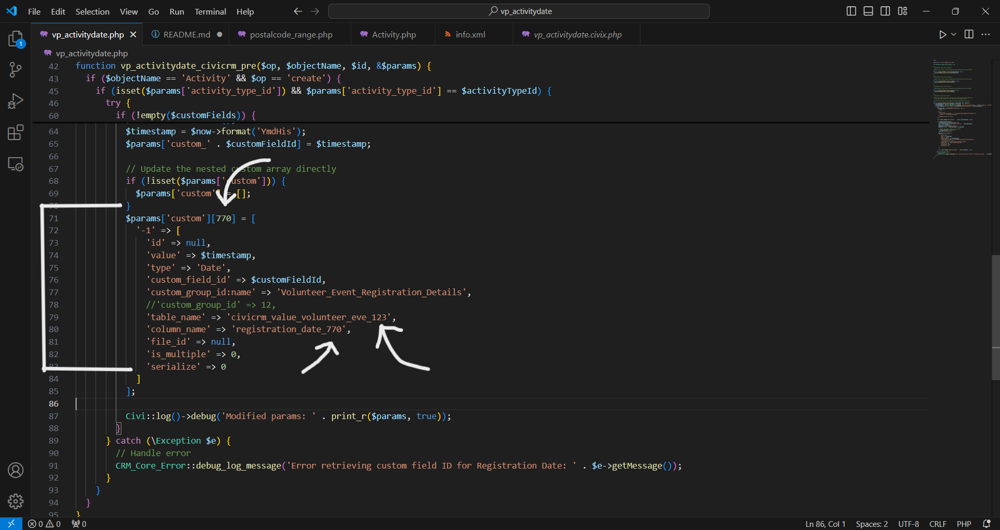

# vp_activitydate

## Objective
This extension is to auto-populate the custom Registration Date field with the present(current) date and time.

## Before Installing the Extension
1. Download the extension and extract the zip file.
2. Create a new custom field inside the below custom field set in CiviCRM Site.
    activity type    = Volunteer Event Registration
    custom field set = Volunteer Event Registration Details
    custom field     = Registration Date

3. Take note of the IDs of 
    - custom field "Registration Date"
    - custom field set "Volunteer Event Registration Details"
   You can find in CiviCRM "Administer >> Custom Data and Screens >> Custom Fields".

4. Open "vp_activitydate.php" and find the below code snippet (around line 71 to 85).

        $params['custom'][770] = [
            '-1' => [
              'id' => null,
              'value' => $timestamp,
              'type' => 'Date',
              'custom_field_id' => $customFieldId,
              'custom_group_id:name' => 'Volunteer_Event_Registration_Details',
              'table_name' => 'civicrm_value_volunteer_eve_123',
              'column_name' => 'registration_date_770',
              'file_id' => null,
              'is_multiple' => 0,
              'serialize' => 0
            ]
        ];

5. Replace '770' with the ID of custom field "Registration Date" (You need to change in 2 places).
   Replace '123' with the ID of custom field set "Volunteer Event Registration Details" (You need to change in 1 place).

6. You can now install and enable the extension in your development sites.

## Important
1. Make sure you have the same name for the below data in your site.
 - activity type    = Volunteer Event Registration
 - custom field set = Volunteer Event Registration Details
 - custom field     = Registration Date

2. If the extension doesn't work even after you have changed the IDs, go and check the below name in the database of your site. 
 - 'table_name' => 'civicrm_value_volunteer_eve_123',
 - 'column_name' => 'registration_date_770',
According to your site database, table_name and column_name can be different. Check the names and modify the code if required.

This is an [extension for CiviCRM](https://docs.civicrm.org/sysadmin/en/latest/customize/extensions/), licensed under [AGPL-3.0](LICENSE.txt).

